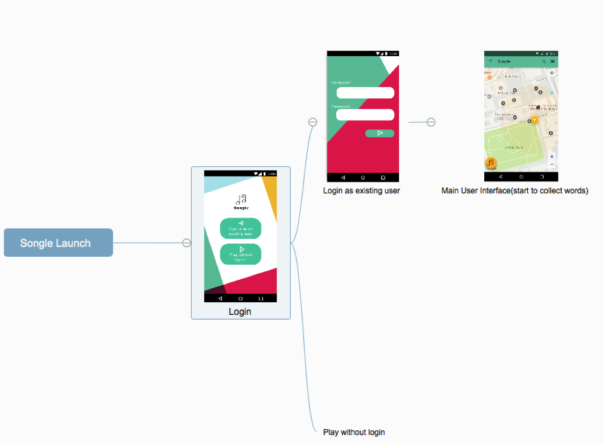
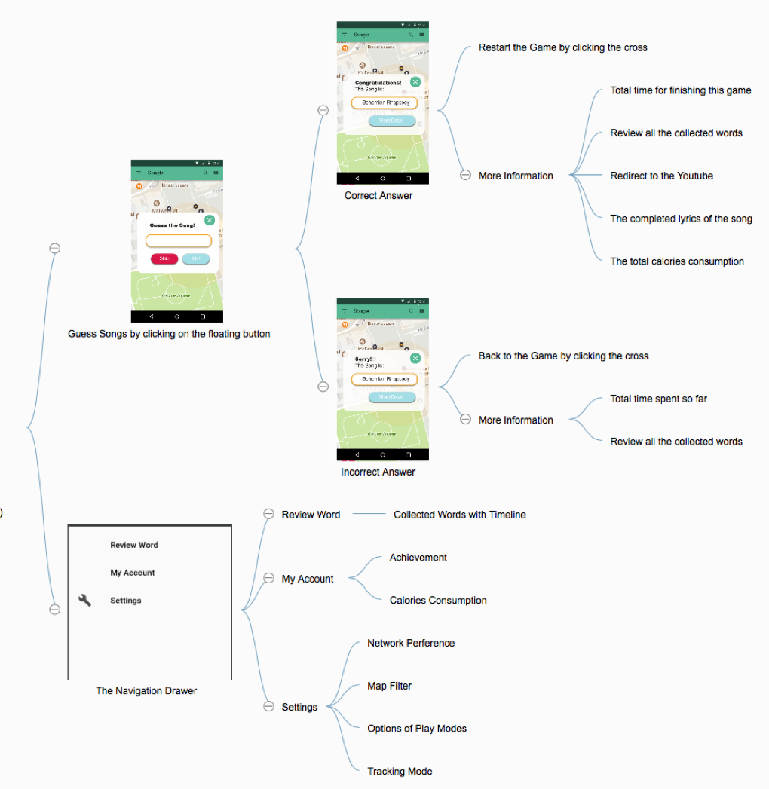
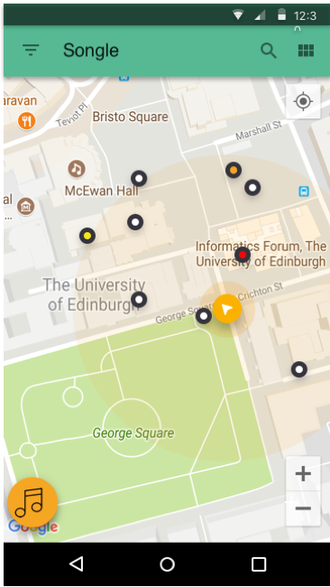
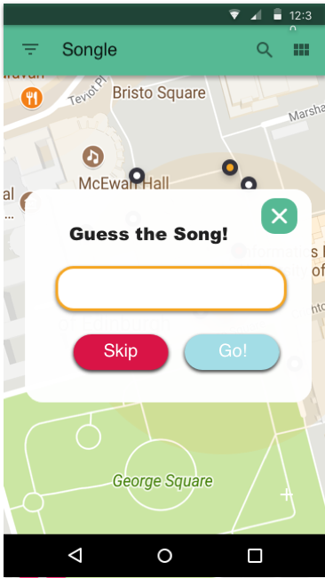
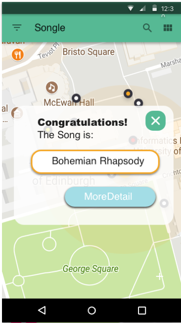
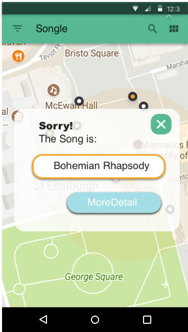

**Table of Contents** 
=====================

1.  **INTRODUCTION**

    1.  About 2

    2.  Description 2

2.  **REVIEW OF KOTLIN**

    3.  Report on Features 2

        2.1.1 Good Features 3

        2.1.2 Bad Features 3

    4.  Overall Evaluation 3

3.  **ALGORITHMS AND DATA STRUCTURE**

    5.  Download and Parsing of XML and KML Files 5

    6.  Persistent Storage of Game Progress

    7.  Words Collection

    8.  Setting of Game Modes

    9.  Display the List of Collected Words

4.  **IMPLEMENTATION OF DESIGN DOCUMENT**

    10. Unimplemented Features 7

    11. Additional Features 9

5.  **ACKNOWLEDGEMENTS** 11

    **1. INTRODUCTION**

1.1 About

According to the coursework specification (Gilmore, 2017), this project
report of Songle will introduce the implementation details of Songle, a
location-based mobile phone puzzle game which allows users to follow a
map and collect words which have been scattered at random around the
University of Edinburgh's Central Area. The project report aims to
presents a brief review on Kotlin which is a new fully supported
programming language on Android, and the technical details regarding the
implementation of Songle. It documents every design and implementation
during the development period of Songle, which are conducive to the
developments of similar Android application based on Kotlin.

1.2 Description

The design document records my experience of using Kotlin to develop
Songle with a brief evaluation on its noticeable features, the
introduction of algorithms and data structures used for the core
functions, and a comparison between design documents and final
implementation.

**2. REVIEW OF KOTLIN**

2.1 Report on Features

> 2.1.1 Good Features

According to the official web site of Kotlin (2017), noteworthy features
of Kotlin, a novel statically-typed programming language that is fully
supported on Android, can be summarized into: Concise, safe,
interoperable and tool-friendly. During the period of Songle
development, those characteristics of Kotlin overwhelmingly shorten its
development cycle.

**Concise features** enable developer to write code in more concise and
readable style, which is critical for the efficient operation and
maintenance at a later stage. For instance, compared to find the view in
Java by invoking the function, findViewById, developers can ask for a
view directly with the code generated by the Kotlin Android Extensions
which will try to seek for the target view in view cache. Additionally,
equipped with Anko (2017), an open source Kotlin library, you can
implement SQLite, utilities, and android layouts in an even more handy
way. The view of toast can be easily called with the code as following:
toast ("Hello World!")

**Null safety** is the most significant features of Kotlin,
distinguishing it from those popular programming languages like Java on
Android Platform.

> 2.1.2 Bad Features

2.2 Core Features

-   Select the Song

> The information of songs to be identified is downloaded via URL and
> parsed into an array of song Kotlin objects. By using the random
> method in Kotlin Library, whenever player enters the main activity or
> restart the game, a function will be automatically invoked to randomly
> select a new song from the song list base on its index. Considering
> the limited number of songs and maps, the songs which have been
> identified before still be able to be chosen again. However, the user
> is highly recommended to play the same songs in different play modes.

-   Collect Words

> Since the Songle is aimed to acquire the fine location of users'
> device, player is able to collect the words, once the location of
> player is sufficiently closed to place marks. To ensure the
> playability and efficiency, Songle will periodically compute the
> distance between place-marks and check if player is closed enough to
> the nearest place. If the distance is under the preset minimum
> distance (10m), Songle will notify the user with pop-up message and
> request for confirming collection.
>
> After successfully collecting the word, the place mark will be mark
> with distinctive symbol or color (adding the filter for distinguishing
> unvisited place-marks from collected place-marks could be one of the
> extra features).

-   Download and Refresh Songs and Maps

> Since accessing the network on the main Android UI thread is
> forbidden, the download task will be executed in a separate thread
> running in the background. Once the Main Activity is started, the xml
> list of songs and maps will be automatically downloaded and parsed
> into array of objects in the background.

-   Review Collected Words

> Reviewing the collected words is applicable whenever the player is
> willing to do so. As the 'Review Word' is one of the items listed in
> the Navigation View, the player only need to simply click the review
> item in navigation view to enter the review screen. The review screen
> is based on the Scrolling Activity and contains the list of collected
> words with timeline (Enabling player to rearrange the order of
> collected words could be one of the extra features).

-   Judge the Answer and Skip the Song

> As the main activity is based on Navigation Drawer Activity, there
> will be a Floating Action Button in the bottom-left corner of the
> screen. If player attempts to guess the name of the given song, a
> Floating Window above the map with an input box for the name of song
> will be triggered by clicking on that Floating Action Button. If the
> guess is correct, the award will be added into the user's personal
> information and user can restart the game with other songs. If the
> guess is incorrect, 30 seconds will be taken from the remaining time
> as punishment (timing-based play is one of the bonus features). In the
> same Floating Window, user also is able to skip the current song by
> clicking on the 'skip' button and restart with other songs.

-   Choose Map Version

> There are totally five different versions of map for each song, each
> giving progressively more hints (version 1 is the hardest one, while
> version 5 is the easiest one). The version of map will be chosen base
> on both the current play mode and the remaining time for player to
> finish the game. For instance, in the hard mode of game, initially
> player will start searching words with the version 1 of map, and if
> it's only 5 minutes left, version 3 of map will be displayed to
> encourage player to finished the game.

-   Off-line Mode

> If a data connection is not available during the game, Songle will
> automatically pause the game and save the collected word into a file.
> Then, if the data connection is available, user is able to resume
> without losing any collected words. The walking trace of player will
> be continually recorded from the last location before pause.

**3. BONUS FEATURE**

3.1 Bonus Features Design

-   Tracking Mode

    Songle will track the location of player during the period of word
    collection. The walking trace will be real-time display on the map
    as kml layer (Figure. 1).

-   Calories Calculation

    According to the distance walked by the user, Songle is aimed to
    have the ability of calculating the calories burnt by walking to
    each place-mark.

    Figure. 1

-   Login

    The player is able to login the Songle with existing account or sign
    up a new account for further recording (Figure.2 and Figure. 3).
    After login, Songle will store the personal data for each user into
    SQLite, including the completed songs, the detail information of
    each game and the total calories consumption when user is playing
    the Songle (statistics regarding to each game or each day).

    

    Figure. 2 Figure. 3

-   Timing-based Play

    Each game has the limited time for promoting user to search the
    place-marks and acquire the words as quickly as possible. The time
    limit will be adapted from 10 to 30 minutes according to different
    play modes.

-   Play Modes

    There are totally 3 play modes:

    **Easy Mode:** Start with the version 3 of map and end with version
    5 of map; Time limit is 30 minutes.

    **Moderate Mode:** Start with the version 2 of map and end with
    version 4 of map; Time limit is 20 minutes.

    **Hard Mode:** Start with the version 1 of map and end with version
    3 of map; Time limit is 10 minutes.

    **4. USER INTERFACE DESIGN**

    4.1 Logic of User Interface

    

    Figure.4 The color matching of UI is inspired by *the Slack "Sign
    In" and "Create a New Team"* (Bondar, 2016)

Figure. 5

4.2 Select Screenshots

The user can have a guess of the name of current song by simply clicking
on the floating button in the bottom-left corner of the main screen
(Figure. 6). A floating window will display with an input box for song
title (Figure. 7). In that floating window, 'Skip' button is designed
for skipping the current song and restart the game with another song.
'Go!' button is designed for check if the answer is correct.

Figure. 6 Main Screen Figure. 7 Guessing Screen

After clicking on the 'Go!' button, another floating window will pop-up
informing whether the guess is correct answer or no. If the answer is
correct, player can play another game by clicking on the cross in the
top-right corner of the floating window. If the answer is incorrect,
game will resume by clicking on the cross (Figure. 8 and Figure. 9).

Figure. 8 Answer is correct Figure. 9 Answer is wrong

**5. Acknowledgements:**

Bondar, A. 2017. *Slack "Sign In" and "Create a New Team"* \[Online\].
\[Accessed 10 November 2017\]. Available from:
<https://sketchrepo.com/free-sketch/slack-sign-in-and-create-a-new-team-sketch-principle-freebie/>

Kotlin. 2017. *Getting started with Android and Kotlin.* \[Online\].
\[Accessed 10 November 2017\]. Available from:
<http://kotlinlang.org/docs/tutorials/kotlin-android.html>

Gilmore, S. 2017. *Computer Science Large Practical.* \[Online\].
\[Accessed 10 November 2017\]. Available from:
<http://www.inf.ed.ac.uk/teaching/courses/cslp/coursework/songle/coursework-cslp.pdf>

[*https://github.com/Kotlin/anko*](https://github.com/Kotlin/anko)

*https://kotlinlang.org*
